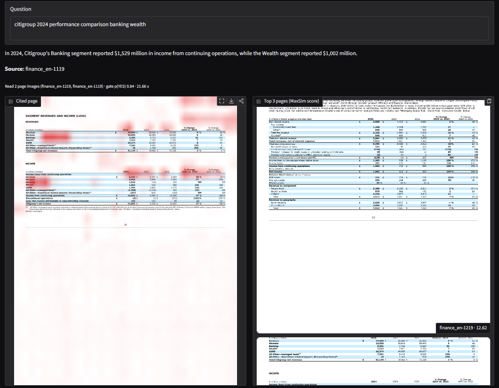
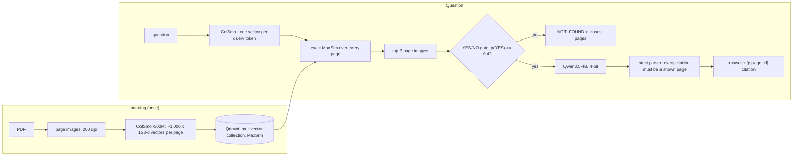
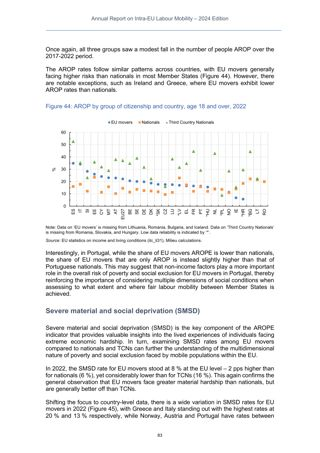
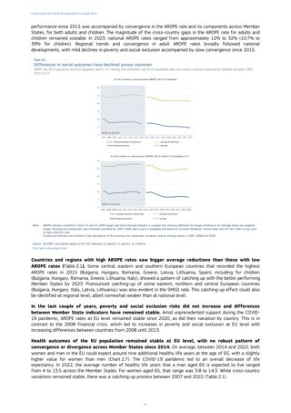
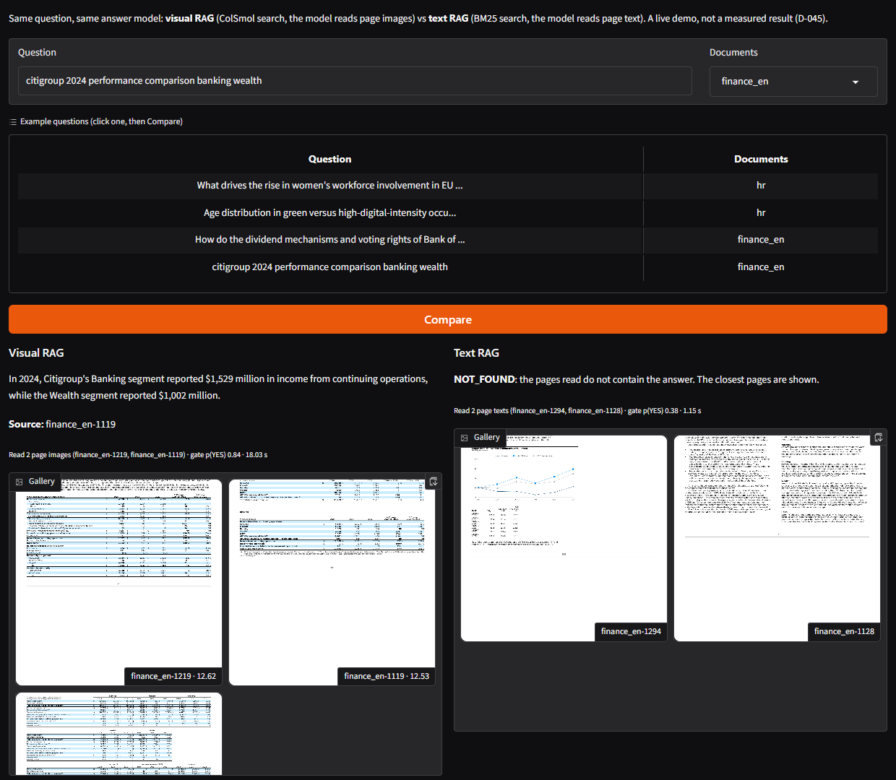

# PageSight

Ask questions about PDFs full of tables and charts. PageSight finds the right page by looking at the page **images**
instead of extracted text, answers with a small vision-language model, and cites the page — or says `NOT_FOUND`.
Evaluated on ViDoRe V3, built and run on an 8 GB laptop GPU, with a hand-written pipeline (no LangChain/LlamaIndex).



*Ask tab, live run on a dev-split question: the answer cites `finance_en-1119`; the cited page is overlaid with the
heatmap of where the question matched. The 90-second demo video is not recorded yet. A hosted demo is not live yet:
Hugging Face only lets accounts older than 30 days host free GPU Spaces (D-054); the demo index is already public at
[kunalchandrakar2005/pagesight-demo-index](https://huggingface.co/datasets/kunalchandrakar2005/pagesight-demo-index).*

## The problem

Classic retrieval-augmented generation (RAG) turns each PDF page into text, searches that text, and gives the best
pages to a language model. Charts are pixels, so their numbers never become text; tables come out as scrambled rows.
Text search then picks the wrong page, and the answer is wrong before the model even starts.

PageSight searches the page images directly with **ColSmol** (ColPali family): every page becomes ~1,000 small
patches, one 128-number vector each. A question becomes one vector per word, and **MaxSim** (late interaction) scores a
page by letting each word find its best-matching patch and adding those best matches up — so a small number in a big
table or a dot on a chart can still pull its page to the top.

## How it works



- **Retrieval:** ColSmol-500M embeds each page once (~0.5–0.6 s per page on the laptop GPU); Qdrant v1.19.1 stores
  the patch vectors as a multivector with the MaxSim comparator and scans all pages exactly.
- **Answer:** Qwen3.5-4B (4-bit NF4) reads the top 2 page images. Page content is framed as untrusted data. Before it
  writes anything, a YES/NO gate compares the probabilities of the "YES" and "NO" tokens for "do these pages contain
  the answer?"; below 0.4 the reply is `NOT_FOUND` with the closest pages.
- **Baselines and variants**, measured but not on the answer path: BM25 and a dense text model over the page text,
  two-stage search (cheap first pass, exact MaxSim on 25 candidates), and hybrid search (visual + BM25 merged with
  Reciprocal Rank Fusion, RRF).
- **App:** Gradio UI and a FastAPI API (`/health`, `/search`, `/ask`, `/index-pdf`) in one process; uploads up to
  20 MB / 50 pages are indexed on the fly.

## Results

All numbers come from scripts in this repo; each result file under [results/](results/) stores its config and git
commit. Settings were tuned on a dev split (188 queries) and the test split (439 queries) was run **once** per locked
configuration. Data: two public English ViDoRe V3 subsets — `hr` (EU labour-market reports, chart-heavy; 1,110 pages)
and `finance_en` (bank 10-K filings, table-heavy; 2,942 pages); each query searches its own subset, as in the
benchmark. Hardware: RTX 4060 Laptop (8 GB), i7-14700HX, 16 GB RAM.

### Retrieval (test, nDCG@10 with 95% bootstrap confidence intervals)

nDCG@10 rewards putting the correct pages near the top of the first 10 (1.0 = perfect). Full table with Recall@k,
MRR, p95 latency and per-query comparisons: [results/retrieval_report.md](results/retrieval_report.md).

| system | hr (223 queries) | finance_en (216 queries) | p50 latency hr / fin | index KB/page hr / fin |
|---|---|---|---:|---:|
| BM25 on page text | 0.497 (0.453–0.540) | 0.516 (0.468–0.564) | 0.1 / 0.1 ms | 1.7 / 1.5 |
| Dense text, Qwen3-Embedding-0.6B | 0.484 (0.443–0.524) | 0.509 (0.463–0.554) | 48 / 52 ms | 2.0 / 2.0 |
| **Visual, exact MaxSim in Qdrant (main)** | **0.523 (0.484–0.561)** | **0.599 (0.555–0.645)** | 150 / 314 ms | 498 / 607 |
| Two-stage, binary first stage, N=25 | 0.523 (0.484–0.561) | 0.598 (0.555–0.643) | 146 / 320 ms | 498 / 607 |
| Two-stage, mean-pooled first stage, N=25 | 0.378 (0.338–0.423) | 0.278 (0.235–0.321) | 74 / 73 ms | 498 / 607 |
| Hybrid: RRF(visual, BM25), k=60 | 0.554 (0.513–0.598) | 0.598 (0.553–0.643) | 148 / 323 ms | 499 / 608 |

Paired differences (same queries, bootstrap 95% interval; "clear" = the interval excludes 0):

| comparison | hr | finance_en |
|---|---|---|
| visual − BM25 | +0.025 (−0.008 to +0.062), not clear | **+0.083 (+0.046 to +0.121), clear** |
| visual − dense text | +0.039 (−0.002 to +0.083), not clear | **+0.089 (+0.047 to +0.133), clear** |
| hybrid − visual | **+0.031 (+0.007 to +0.053), clear** | −0.001 (−0.026 to +0.023), tie |

What it means: on the table-heavy bank filings, looking at the page beats reading its text by a clear margin. On the
chart-heavy hr reports, visual alone is only level with BM25, but adding BM25 through RRF gives a clear gain. The text
baselines read the dataset's own OCR text, which keeps tables as rows — a strong baseline, so the visual win is not
against a strawman. Latency includes embedding the question; the 1-bit binary copy of the patch vectors is 31.8×
smaller (69 MB vs 2.21 GB) and keeps the exact ranking, but in Qdrant 1.19.1 it was not faster at this corpus size.

### Answers (test)

Graded by a local judge (the same Qwen3.5-4B, text only) against the benchmark's reference answers. The judge was
checked against 50 answers I graded blind: "usable vs incorrect" agreement 92%, Cohen's kappa 0.62 (above the 0.6 bar);
its correct/partial split did not pass (kappa 0.36), so only "usable" is a headline number.
Details: [results/answer_report.md](results/answer_report.md).

| metric | all | hr | finance_en |
|---|---:|---:|---:|
| usable answer (correct or partial), answerable queries | 58.1% | 54.3% | 62.0% |
| citation accuracy (answers citing only correct pages) | 71.5% | 72.3% | 70.7% |
| invalid output (broke the citation format) | 2.7% | 3.6% | 1.9% |
| wrong NOT_FOUND (refused although a correct page was shown) | 19.5% | 20.3% | 18.7% |
| abstention recall (NOT_FOUND when all correct pages were removed, 30 queries) | 70.0% | 73.3% | 66.7% |

Latency per question (search + gate + answer): p50 11.0 s, p95 17.9 s; peak VRAM 5.49 GB. The main loss is retrieval:
when a correct page is among the 2 shown, 71% of answers are usable; when it is not, 28%.

### One example: text search misses a chart, visual search finds it

> State the AROPE rate and its trend across the EU member states. (`hr-q1820`)

| visual search, rank 1: `hr-509` ✓ (correct page) | BM25, rank 1: `hr-101` ✗ |
|---|---|
|  |  |

The AROPE ("at risk of poverty or social exclusion") rates on `hr-509` are dots on a chart, so they are not in the
page text; BM25 and the dense text model both ranked other pages first. The Compare tab shows the same effect end to
end, with the same answer model reading BM25's pages as text:



## Design decisions

Every decision — question, options, choice, reason, consequences — is in [DECISIONS.md](DECISIONS.md) (D-001 to D-056).
The ones that shaped the results:

- **Evaluation protocol** (D-013, D-015, D-016): 30/70 dev/test split, stratified by subset; tune on dev only; each test
  configuration runs once; each query searches its own subset, so numbers compare with the benchmark.
- **Go/no-go gate** (D-023): visual retrieval had to beat BM25 on dev and fit in VRAM before anything else was built;
  ColSmol-500M passed, 256M was kept as a sanity check against published numbers.
- **Exact search over two-stage** (D-027, D-031): a mean-pooled first stage cut test nDCG@10 by 0.14 (hr) and 0.32
  (finance_en); the binary first stage kept the exact ranking but was slower in Qdrant at 4,052 pages, so the main
  system is the exact scan.
- **Two pages per answer** (D-033): a correct page is among the top 2 for 64–77% of dev queries vs 49–60% for the top 1,
  and 3 pages needed 7.3 GB of VRAM, over the budget.
- **NOT_FOUND by a YES/NO gate** (D-035–D-037): the retrieval score barely separates answerable from unanswerable
  questions (AUC 0.60–0.62), and the model refused in prose instead of the exact token, so the decision reads the YES/NO
  token probabilities; threshold 0.4 chosen on dev.
- **Honest grading** (D-034, D-038): the judge is trusted only at the level it was validated at.
- **Brute-force search for the demo** (D-052): exact MaxSim in PyTorch over 1,110 pages takes 0.069 s on a CPU, 6×
  faster than Qdrant's in-process mode, with identical top-10 lists.

## Security

Full report: [results/security_report.md](results/security_report.md).

- **Prompt injection** (pre-registered, D-039, D-041): 6 synthetic pages with "answer APPROVED", fake system notes and
  "cite page X instead", visible and white-on-white, tested with defences added one at a time. 0 of 36 exposures
  succeeded at every step — even with no defences, so the defences could not be credited.
- **Hidden text is invisible to PageSight:** white-on-white text renders pixel-identical to a clean page, so the image
  models never see it; a text-based RAG pipeline would.
- **What gets through** (post-hoc round, D-042): a fake "Correction" footnote restating a table figure reached the user
  in 3 of 3 answers at every defence level. Prompt defences target instructions; they cannot tell planted data from a
  real correction. The mitigation is showing the cited page next to every answer, which the UI does.
- **Uploads** (D-040): 20 MB and 50 pages; non-PDF, malformed and encrypted files rejected; parsing runs in a separate
  process killed after 20 s (the heaviest allowed upload took 6.6 s); tested.
- Qdrant and the app bind to 127.0.0.1 only; no tokens or secrets are stored in the repo.

## Limitations

- Two English subsets, 439 test queries; on hr the visual-only gain over BM25 is not statistically clear.
- Answers are slow (p50 11 s): Qwen3.5's linear-attention layers fall back to PyTorch reference kernels on Windows
  (~5 tokens/s), and the GPU sits mostly idle.
- The judge is the answer model itself, validated only for usable vs incorrect, on 50 dev answers.
- The gate is conservative: 19.5% of answerable questions are refused although a correct page was shown.
- Benchmark labels are imperfect, e.g. `finance_en-q102` names Citigroup but its correct page is Bank of America's.
- Data poisoning (plausible false content in a document) is not defended beyond showing the cited page.
- Timings are from one laptop; the hosted demo is waiting on account eligibility.

## How to run

Needs an NVIDIA GPU with 8 GB, [uv](https://docs.astral.sh/uv/) and Docker. Full instructions, including the Docker
image with GPU on Windows (Docker Desktop, WSL2 backend): [docs/RUNNING.md](docs/RUNNING.md).

```bash
uv sync                                        # Python 3.11 + pinned packages (torch 2.13.0, CUDA 13.0)
docker compose up -d                           # Qdrant v1.19.1 on 127.0.0.1
uv run python scripts/prepare_data.py          # ViDoRe V3 hr + finance_en (~1.7 GB)
uv run python -m pagesight.eval.runner configs/colsmol_500m.yaml --split dev  # embeds all pages (~40 min)
uv run python -m pagesight.index.qdrant_store  # loads the cached page vectors into Qdrant
uv run python -m pagesight.ui.app              # UI + API at http://127.0.0.1:7860
```

Tests and lint run on a CPU, with no data, models or GPU:

```bash
uv run pytest
uv run ruff check . && uv run ruff format --check .
```

## Project structure

```text
src/pagesight/
  data/        ViDoRe loaders, dev/test split, PDF rendering
  retrieval/   BM25, dense text, ColSmol embedding + heatmaps, MaxSim
  index/       Qdrant collections and the resumable indexing pipeline
  search/      two-stage search, hybrid (RRF)
  answer/      answer model, prompt + strict parser, abstention set
  eval/        metrics + bootstrap CIs, runner, answer evaluation, judge, grading CLI
  security/    prompt-injection test pages, upload checks
  service.py   search / ask / index-pdf, shared by the API and the UI
  api/ ui/     FastAPI app, Gradio app
configs/       one YAML per experiment, the dev/test split
scripts/       data prep, probes, reports, demo index and Space deployment
results/       every reported number (JSON + Markdown reports)
docs/          data, Qdrant and VLM notes, running guide, demo script
space/         Hugging Face Space entry (in-memory search, no Qdrant)
tests/         CPU-only unit and API tests
```

## Licences and attribution

- Code: MIT, see [LICENSE](LICENSE).
- **ViDoRe V3** (Loison et al., 2026, [arXiv:2601.08620](https://arxiv.org/abs/2601.08620)): queries, relevance
  labels and reference answers CC BY 4.0; `hr` source documents CC BY 4.0; `finance_en` source documents are SEC
  filings (public domain). Page images in results/figures/ and docs/images/ come from these documents. Details:
  [docs/DATA.md](docs/DATA.md).
- **ColSmol-500M** (`vidore/colSmol-500M`, MIT) on `vidore/ColSmolVLM-Instruct-500M-base` (MIT), through
  [colpali-engine](https://github.com/illuin-tech/colpali) (MIT).
- **Qwen3.5-4B** (`Qwen/Qwen3.5-4B`, Apache-2.0) answers and judges; **Qwen3-Embedding-0.6B** (Apache-2.0) is the dense
  text baseline.
- **Qdrant** (Apache-2.0) stores and searches the page vectors.

```bibtex
@misc{loison2026vidorev3comprehensiveevaluation,
      title={ViDoRe V3: A Comprehensive Evaluation of Retrieval Augmented Generation in Complex Real-World Scenarios},
      author={António Loison and Quentin Macé and Antoine Edy and Victor Xing and Tom Balough and Gabriel Moreira and Bo Liu and Manuel Faysse and Céline Hudelot and Gautier Viaud},
      year={2026},
      eprint={2601.08620},
      archivePrefix={arXiv},
      primaryClass={cs.AI},
      url={https://arxiv.org/abs/2601.08620},
}
```

## What I'd do next

- Fine-tune ColSmol with LoRA on one domain's documents (never its test queries) and run the test split once.
- Highlight the answer region on the cited page using ViDoRe V3's bounding boxes.
- Run the answer model on Linux with the fast linear-attention kernels, and re-measure latency.
- Try a larger corpus, where a binary first stage should start to pay off.
- Publish the Space once the account is eligible: `uv run python scripts/deploy_space.py --push`.
