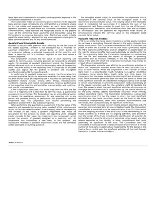
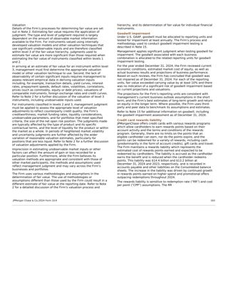
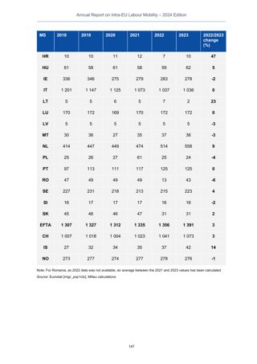
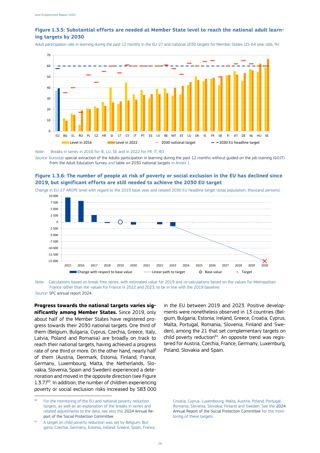
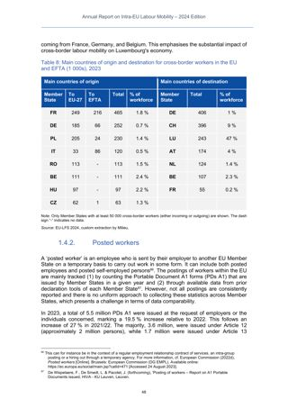
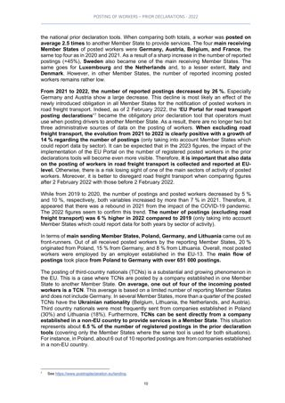

# Retrieval report (test split)

Generated by `scripts/retrieval_report.py` at bba90a0 from one test run per system (D-013): `bm25-test-20261003T232603Z` (05db6ff), `dense_qwen3-test-20261003T232608Z` (05db6ff), `colsmol_500m-test-20261003T233539Z` (05db6ff), `qdrant_exact-test-20261003T233659Z` (05db6ff), `two_stage_mean-test-20261003T233906Z` (05db6ff), `two_stage_binary-test-20261003T233958Z` (05db6ff), `hybrid-test-20261003T235018Z` (a2da435).
Settings were locked on dev before the test runs (D-028–D-031). Latency is per query,
including query embedding. KB/page = index size: BM25 score matrix, dense vectors, the
bf16 ColSmol cache on disk, or the Qdrant collection on disk (allocated bytes, Group 4);
for binary, also the 1-bit copy that the first stage scans.

## hr: 223 queries, 1110 pages

| system | nDCG@10 (95% CI) | R@1 | R@5 | R@10 | MRR@10 | p50 ms | p95 ms | KB/page | peak VRAM GB |
|---|---|---:|---:|---:|---:|---:|---:|---:|---:|
| BM25 (text) | 0.497 (0.453–0.540) | 0.192 | 0.420 | 0.553 | 0.615 | 0.1 | 0.3 | 1.7 | 0.0 |
| Dense Qwen3-Embedding-0.6B (text) | 0.484 (0.443–0.524) | 0.192 | 0.382 | 0.533 | 0.617 | 47.5 | 55.4 | 2.0 | 5.88 |
| Visual brute force (GPU) | 0.523 (0.484–0.561) | 0.202 | 0.461 | 0.568 | 0.647 | 74.8 | 95.1 | 219.0 | 1.82 |
| Visual exact (Qdrant) — main | 0.523 (0.484–0.561) | 0.202 | 0.461 | 0.568 | 0.647 | 150.3 | 185.6 | 497.7 | 0.92 |
| Two-stage, mean-pooled first stage, N=25 | 0.378 (0.338–0.423) | 0.155 | 0.328 | 0.383 | 0.516 | 74.0 | 98.3 | 497.7 | 0.92 |
| Two-stage, binary first stage, N=25 | 0.523 (0.484–0.561) | 0.202 | 0.461 | 0.568 | 0.647 | 146.2 | 183.9 | 497.7 (scan: 13.8) | 0.92 |
| Hybrid: RRF of visual exact + BM25 | 0.554 (0.513–0.598) | 0.218 | 0.459 | 0.598 | 0.665 | 148.3 | 181.6 | 499.4 | 0.92 |

| paired comparison (nDCG@10) | Δ mean (95% CI) | wins / ties / losses |
|---|---|---|
| Visual exact (Qdrant) — main − BM25 (text) | +0.025 (-0.008 to +0.062) | 99 / 36 / 88 |
| Visual exact (Qdrant) — main − Dense Qwen3-Embedding-0.6B (text) | +0.039 (-0.002 to +0.083) | 109 / 32 / 82 |
| Hybrid: RRF of visual exact + BM25 − Visual exact (Qdrant) — main | +0.031 (+0.007 to +0.053) | 103 / 67 / 53 |
| Hybrid: RRF of visual exact + BM25 − BM25 (text) | +0.057 (+0.034 to +0.082) | 111 / 52 / 60 |
| Hybrid: RRF of visual exact + BM25 − Dense Qwen3-Embedding-0.6B (text) | +0.070 (+0.029 to +0.114) | 117 / 34 / 72 |
| Two-stage, binary first stage, N=25 − Visual exact (Qdrant) — main | +0.000 (+0.000 to +0.001) | 2 / 221 / 0 |
| Two-stage, mean-pooled first stage, N=25 − Visual exact (Qdrant) — main | -0.144 (-0.187 to -0.106) | 55 / 60 / 108 |
| Visual brute force (GPU) − Visual exact (Qdrant) — main | +0.000 (+0.000 to +0.000) | 0 / 223 / 0 |

## finance_en: 216 queries, 2942 pages

| system | nDCG@10 (95% CI) | R@1 | R@5 | R@10 | MRR@10 | p50 ms | p95 ms | KB/page | peak VRAM GB |
|---|---|---:|---:|---:|---:|---:|---:|---:|---:|
| BM25 (text) | 0.516 (0.468–0.564) | 0.250 | 0.452 | 0.564 | 0.631 | 0.1 | 0.2 | 1.5 | 0.0 |
| Dense Qwen3-Embedding-0.6B (text) | 0.509 (0.463–0.554) | 0.229 | 0.448 | 0.566 | 0.631 | 52.4 | 66.4 | 2.0 | 3.7 |
| Visual brute force (GPU) | 0.599 (0.555–0.645) | 0.283 | 0.546 | 0.644 | 0.697 | 100.1 | 510.3 | 285.0 | 4.22 |
| Visual exact (Qdrant) — main | 0.599 (0.555–0.645) | 0.283 | 0.546 | 0.644 | 0.697 | 313.6 | 424.6 | 606.9 | 0.93 |
| Two-stage, mean-pooled first stage, N=25 | 0.278 (0.235–0.321) | 0.136 | 0.251 | 0.269 | 0.413 | 72.9 | 88.8 | 606.9 | 0.93 |
| Two-stage, binary first stage, N=25 | 0.598 (0.555–0.643) | 0.283 | 0.546 | 0.644 | 0.697 | 319.5 | 440.7 | 606.9 (scan: 17.8) | 0.93 |
| Hybrid: RRF of visual exact + BM25 | 0.598 (0.553–0.643) | 0.276 | 0.534 | 0.652 | 0.704 | 323.3 | 432.2 | 608.4 | 0.93 |

| paired comparison (nDCG@10) | Δ mean (95% CI) | wins / ties / losses |
|---|---|---|
| Visual exact (Qdrant) — main − BM25 (text) | +0.083 (+0.046 to +0.121) | 113 / 47 / 56 |
| Visual exact (Qdrant) — main − Dense Qwen3-Embedding-0.6B (text) | +0.089 (+0.047 to +0.133) | 100 / 42 / 74 |
| Hybrid: RRF of visual exact + BM25 − Visual exact (Qdrant) — main | -0.001 (-0.026 to +0.023) | 79 / 64 / 73 |
| Hybrid: RRF of visual exact + BM25 − BM25 (text) | +0.083 (+0.060 to +0.106) | 123 / 62 / 31 |
| Hybrid: RRF of visual exact + BM25 − Dense Qwen3-Embedding-0.6B (text) | +0.089 (+0.044 to +0.135) | 108 / 35 / 73 |
| Two-stage, binary first stage, N=25 − Visual exact (Qdrant) — main | -0.001 (-0.002 to +0.000) | 2 / 213 / 1 |
| Two-stage, mean-pooled first stage, N=25 − Visual exact (Qdrant) — main | -0.321 (-0.372 to -0.271) | 30 / 40 / 146 |
| Visual brute force (GPU) − Visual exact (Qdrant) — main | +0.000 (+0.000 to +0.000) | 0 / 216 / 0 |

## Examples (test split)

Candidates: 9 queries where text failed and visual was right at rank 1; 6 where visual missed the top 10 and BM25 was right at rank 1. ✓ = a gold page.

### Text failed, visual right: `hr-q1820` (Chart, Infographic, Text)

> State the AROPE rate and its trend across the EU member states.

- Gold pages: hr-383 (grade 1), hr-504 (grade 1), hr-507 (grade 1), hr-508 (grade 1), hr-509 (grade 1), hr-526 (grade 1)
- BM25 top 3: hr-101 ✗, hr-578 ✗, hr-620 ✗
- Dense top 3: hr-101 ✗, hr-100 ✗, hr-690 ✗
- Visual exact top 3: hr-509 ✓, hr-690 ✗, hr-101 ✗

| visual top 1 | BM25 top 1 |
|---|---|
|  |  |

### Text failed, visual right: `finance_en-q145` (Table, Text)

> State the areas where Bank of America applies impairment testing.

- Gold pages: finance_en-2641 (grade 2), finance_en-2675 (grade 2), finance_en-2927 (grade 1)
- BM25 top 3: finance_en-74 ✗, finance_en-2938 ✗, finance_en-1118 ✗
- Dense top 3: finance_en-2870 ✗, finance_en-2873 ✗, finance_en-2876 ✗
- Visual exact top 3: finance_en-2641 ✓, finance_en-2675 ✓, finance_en-2938 ✗

| visual top 1 | BM25 top 1 |
|---|---|
|  |  |

### Text failed, visual right: `hr-q206` (Table, Text)

> Mobility rate year-on-year change direction, HU, 2018 to 2023.

- Gold pages: hr-379 (grade 1), hr-476 (grade 1)
- BM25 top 3: hr-624 ✗, hr-472 ✗, hr-477 ✗
- Dense top 3: hr-417 ✗, hr-406 ✗, hr-401 ✗
- Visual exact top 3: hr-379 ✓, hr-401 ✗, hr-388 ✗

| visual top 1 | BM25 top 1 |
|---|---|
|  |  |

### Visual failed, BM25 right: `hr-q80` (Table, Text)

> What are the predominant third-country nationalities involved in worker postings within the EU, and in which main sectors are they employed across different member states?

- Gold pages: hr-958 (grade 1), hr-960 (grade 2), hr-969 (grade 1), hr-976 (grade 1), hr-983 (grade 1), hr-987 (grade 1), hr-991 (grade 1), hr-993 (grade 1), hr-994 (grade 1), hr-999 (grade 1), hr-1008 (grade 2)
- BM25 top 3: hr-1008 ✓, hr-230 ✗, hr-7 ✗
- Dense top 3: hr-973 ✗, hr-993 ✓, hr-501 ✗
- Visual exact top 3: hr-470 ✗, hr-973 ✗, hr-500 ✗

| visual top 1 | BM25 top 1 |
|---|---|
|  |  |

Page images: ViDoRe V3 (hr source documents CC BY 4.0; finance_en SEC filings, public
domain); queries and relevance labels CC BY 4.0 (docs/DATA.md).
